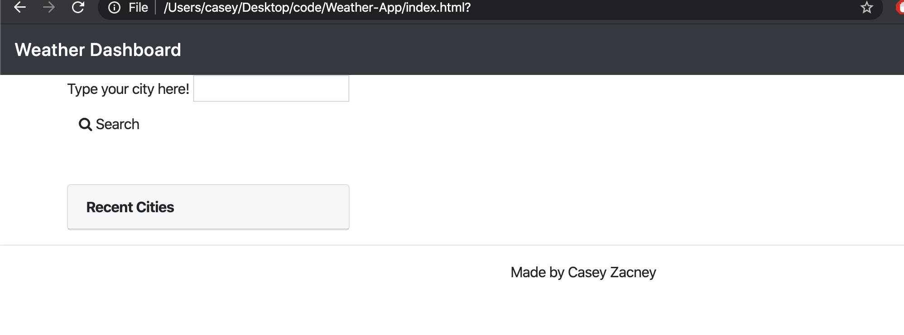

Weather Dashboard

Using third-party API, this weather dashboard app allows users to search for current weather and 5-day forecasts of any city they enter into the search bar feature. Recent searches are saved via local storage and appear in a list on the side, while the uv index changes background color based on the weather conditions. 

Live Weather Dashboard:
https://czacney.github.io/Weather-App/